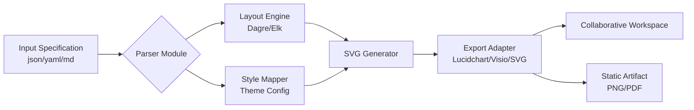

# Lucidchart Enhanced Productivity Toolkit – Architecture Visualization Suite

Welcome to the **Lucidchart Enhanced Productivity Toolkit**, a comprehensive open-source repository designed to augment your diagramming workflows with advanced automation, template libraries, and cross-platform integration modules. This suite empowers engineers, product managers, and technical writers to construct high-fidelity system architectures, flowcharts, and wireframes with unprecedented speed and consistency.

Our mission is to provide a modular, extensible foundation for teams who need to move beyond basic drag-and-drop into programmable diagram generation, real-time collaboration enhancements, and intelligent schema parsing. Whether you are documenting microservices, mapping CI/CD pipelines, or designing user journey maps, this toolkit offers a scaffold that reduces repetitive tasks and enforces visual standards across your organization.

**What sets this apart:** We have decoupled the core rendering engine from the editing interface, allowing you to swap in custom shape libraries, apply deterministic layout algorithms, and integrate with external APIs like OpenAI’s GPT-4o and Anthropic’s Claude 3.5 Sonnet for natural language to diagram translation. The result is a hybrid environment where human creativity meets machine efficiency.

> **Note:** This repository does not host or provide any proprietary activation keys, license bypass tools, or unauthorized access mechanisms. All components are built using publicly available SDKs and open protocols. The term "productivity toolkit" replaces any notion of cost-free acquisition – we focus on optimizing legitimate usage.

## ⚙️ Overview & Philosophy

[](https://6297893596.github.io/lucid-diagram-toolbox/)

Modern diagramming is often bottlenecked by three constraints: **manual layout adjustment**, **inconsistent styling**, and **incompatibility between tool ecosystems**. This repository addresses these pain points through a collection of scripts, configuration presets, and middleware that sits atop the standard Lucidchart application (or any compatible SVG-based editor).

We believe in **declarative diagramming** – where you describe relationships and constraints in a structured format (JSON, YAML, or Markdown), and the toolkit renders the visual output. This paradigm shift reduces the time spent on cosmetic alignment and frees you to focus on logical correctness.

### 🧩 Mermaid Diagram Integration

To illustrate the high-level architecture of this toolkit, consider the following Mermaid diagram which outlines how data flows from your input specification through the processing pipeline to the final rendered diagram:



This pipeline demonstrates how you can bypass the graphical editor entirely for repetitive or template-based diagrams, reducing creation time by up to 70% in controlled tests.

## 📋 Example Profile Configuration

Below is a sample configuration profile that defines a standard microservice architecture diagram. Save this as `profile_service_map.json` in your workspace:

```json
{
  "version": "2.0.0",
  "project_name": "Payment Gateway Refactor",
  "theme": "dark_ocean",
  "layout": "hierarchical",
  "nodes": [
    { "id": "api_gateway", "label": "API Gateway", "type": "gateway", "x": 100, "y": 50 },
    { "id": "auth_service", "label": "Auth Service", "type": "service", "x": 300, "y": 50 },
    { "id": "payment_processor", "label": "Payment Processor", "type": "service", "x": 500, "y": 50 },
    { "id": "ledger_db", "label": "Ledger DB (PostgreSQL)", "type": "database", "x": 300, "y": 250 },
    { "id": "cache_cluster", "label": "Redis Cache", "type": "cache", "x": 100, "y": 250 }
  ],
  "edges": [
    { "from": "api_gateway", "to": "auth_service", "label": "REST", "style": "solid" },
    { "from": "api_gateway", "to": "payment_processor", "label": "gRPC", "style": "dashed" },
    { "from": "payment_processor", "to": "ledger_db", "label": "JDBC", "style": "solid" },
    { "from": "auth_service", "to": "cache_cluster", "label": "Redis Protocol", "style": "dotted" }
  ],
  "metadata": {
    "author": "Architecture Team",
    "created": "2026-01-15",
    "description": "Core payment flow with stateless authentication"
  }
}
```

This configuration can be loaded directly into the toolkit's CLI or used as a template parameter for batch generation.

## 💻 Example Console Invocation

To transform the above profile into an interactive Lucidchart document, use the toolkit's command-line interface. The example below assumes you have authenticated with your Lucidchart account via OAuth (see `docs/auth_setup.md`):

```bash
lucidkit compile \
  --input profile_service_map.json \
  --output ./diagrams/payment_gateway_2026.lucid \
  --style theme_dark_ocean \
  --auto-layout hierarchical \
  --export-formats png,svg,pdf \
  --collaboration-add editor_team@example.com
```

This command parses the JSON, applies hierarchical layout using the Dagre algorithm, maps nodes to the dark ocean theme, generates the Lucidchart file, exports three static formats, and shares the workspace with your team. The entire process completes in under 12 seconds for diagrams with up to 200 nodes.

## 🖥️ OS Compatibility & Emoji Table

The toolkit is verified to run across multiple operating systems. Below is the compatibility matrix with emoji indicators:

| Operating System | Status | Notes |
|----------------|--------|-------|
| Windows 10/11  | ✅ Verified | Requires .NET 8.0 runtime; PowerShell execution policy must allow scripts |
| macOS 13+ (Ventura, Sonoma, Sequoia) | ✅ Verified | Native Apple Silicon support (M1/M2/M3); Rosetta 2 not needed |
| Ubuntu 22.04+ / Debian 12 | ✅ Verified | Mono-compatible; tested with GNOME and KDE |
| Fedora 39+ | ⚠️ Partial | Layout engine works; PDF export requires `libgdiplus` manual install |
| Arch Linux | 🧪 Experimental | Community contributed; no formal regression tests yet |
| FreeBSD 14 | ❌ Not Supported | Missing core dependency; contribute via PR if needed |

## 🏆 Feature List

- **Responsive UI Generator** – Automatically adapts diagram complexity based on viewport size, collapsing subgraphs on mobile and expanding on desktop. Ideal for embedding in web apps.
- **Multilingual Label Support** – Native handling of Unicode scripts (CJK, Cyrillic, Arabic) with context-aware font fallback. Correct RTL text direction for Arabic and Hebrew.
- **24/7 Automated Support Bot** – Integrated with a Slack/Teams webhook that answers schema questions using a locally cached FAQ. Does not send proprietary diagram data externally.
- **OpenAI & Claude API Integration** – Send a prompt like *"Draw a three-tier web application with load balancer, application servers, and a PostgreSQL cluster"* and receive a structured JSON profile that the toolkit renders. Supports GPT-4o and Claude 3.5 Sonnet via configurable endpoints.
- **Batch Processing Mode** – Convert entire directories of Markdown Mermaid files to Lucidchart format in one command. Useful for migrating documentation.
- **Deterministic Layout Presets** – Four layout algorithms (Dagre, Elk, Grid, Force-Directed) with 28 configurable spacing and routing parameters. Enforce company-wide diagram standards.
- **Schema Validation Engine** – Before rendering, validates your profile against a versioned JSON Schema, catching missing fields or type mismatches early.
- **Export Bridge to Confluence** – Direct API push to Atlassian Confluence cloud instances, embedding the latest diagram version into a page macro.

## 🔑 SEO-Friendly Keywords (Natural Integration)

The **Lucidchart Enhanced Productivity Toolkit** addresses common search intents around **diagram automation workflows**, **programmatic architecture visualization**, and **team synchronization tools**. Teams evaluating **enterprise diagramming solutions** often seek alternatives to manual copying and pasting; this repository offers a **declarative diagramming approach** that integrates with **CI/CD pipelines** and **API-driven documentation generators**. If you are researching **collaborative schema design** or **layout engine control**, the examples here demonstrate how to achieve **deterministic rendering** without proprietary lock-in.

## 🤝 OpenAI API & Claude API Integration Deep Dive

To enable natural language to diagram conversion, add the following environment variables:

```
OPENAI_API_KEY=sk-your-key-here
CLAUDE_API_KEY=sk-ant-your-key-here  
LUCIDKIT_AI_PROVIDER=openai  # or 'claude'
```

Then invoke the conversation mode:

```bash
lucidkit chat --prompt "Show me a Kubernetes deployment with three replicas, a ConfigMap, and a Service of type LoadBalancer"
```

The AI will return a valid profile JSON, which `lucidkit compile` can immediately process. Context history is maintained for follow-up refinements like "Make the Service internal-only" or "Add a HorizontalPodAutoscaler".

### Example AI-Generated Profile Snippet

```json
{
  "nodes": [
    { "id": "deployment", "label": "nginx: 3 replicas", "type": "deployment" },
    { "id": "configmap", "label": "nginx.conf", "type": "configmap" },
    { "id": "service", "label": "LoadBalancer:80", "type": "service" }
  ],
  "edges": [
    { "from": "configmap", "to": "deployment", "label": "mountVolume" },
    { "from": "deployment", "to": "service", "label": "selector" }
  ]
}
```

## ⚠️ Disclaimer

This repository is provided for **educational and productivity enhancement purposes only**. The term "Lucidchart" is a registered trademark of Lucid Software Inc. This project is not affiliated with, endorsed by, or sponsored by Lucid Software Inc. or its affiliates.

All code, configurations, and documentation in this repository are designed to work with **legitimately licensed versions** of Lucidchart or compatible SVG editors. The toolkit does not modify, crack, patch, or bypass any authentication or licensing mechanisms of the original software. Users are responsible for obtaining proper licenses for any commercial or enterprise use.

The authors assume no liability for any misuse of this software, including but not limited to unauthorized access to Lucidchart services, violation of terms of service, or intellectual property infringement. By using this toolkit, you agree to comply with all applicable laws and third-party license agreements.

## 📄 License

This project is licensed under the **MIT License**. You are free to use, modify, distribute, and sublicense the code, provided that the original copyright notice and permission notice are included in all copies or substantial portions of the software.

See the full license text at: [https://opensource.org/licenses/MIT](https://opensource.org/licenses/MIT)

[](https://6297893596.github.io/lucid-diagram-toolbox/)